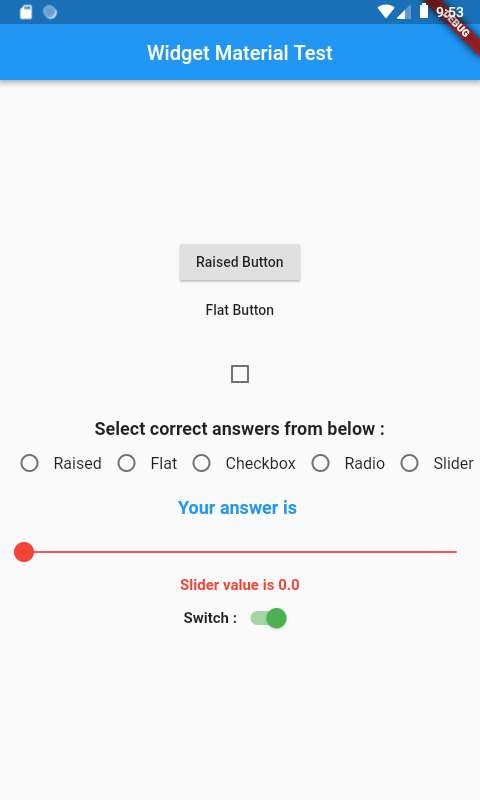
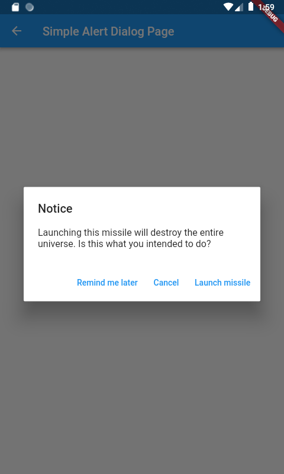

# flutterapp

A new Flutter application.

## Getting Started

This project is a starting point for a Flutter application.

A few resources to get you started if this is your first Flutter project:

- [Lab: Write your first Flutter app](https://flutter.dev/docs/get-started/codelab)
- [Cookbook: Useful Flutter samples](https://flutter.dev/docs/cookbook)

For help getting started with Flutter, view our
[online documentation](https://flutter.dev/docs), which offers tutorials,
samples, guidance on mobile development, and a full API reference.

-------------------------

- First screen :

- Test Text in Screen :

- Test StatelessWidget :

- Test StatefulWidget :

- Test Container Widget :

- Test Scaffold: Row/Column :

- Test Basic List Widget :

- Test List Widget-Array List :

- Test Stack :

- Test GridView :

- Working with AppBar :

- Working with tabbar :

- Container Widget and outside method :

- Container Widget imported from other class :

- Test the Text Field Widget :

- Test the Buttons Widget :

- Test the Checkbox :

- Test the RadioButton :

- Test the Slider :

- Test the Switch :

- Test the Drawer :

- Add Router :

- Add Snackbar :

- Add Alert Dialog :

- Add Other Simple Alert Dialog :

  

<table>
	    <tr>
    	    <td style="padding:5px">
        	    
      	    </td>
            <td style="padding:5px">
            	
             </td>
             <td style="padding:5px">
            	
             </td>
        </tr>
    </table>

---------------------------
---------------------------

Documentation used from :

- Flutter : https://flutter.dev/docs/get-started/install
- Youtube : https://www.youtube.com/watch?v=YPKYT1buIVU
- Udemy Course : https://www.udemy.com/course/learn-flutter-beginners-course/
